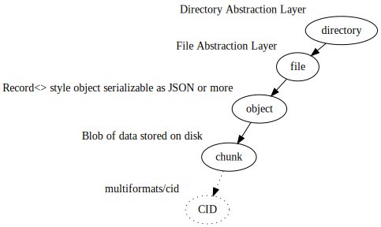

A datalake solution that enables the storage of permissioned arbitrary data blobs and infinite-data computing.

## 🤷‍♀️ How?

TLDR; It stores blobs by hash. And loads and retrieves them...

## 🧑‍🔬 Data Model

