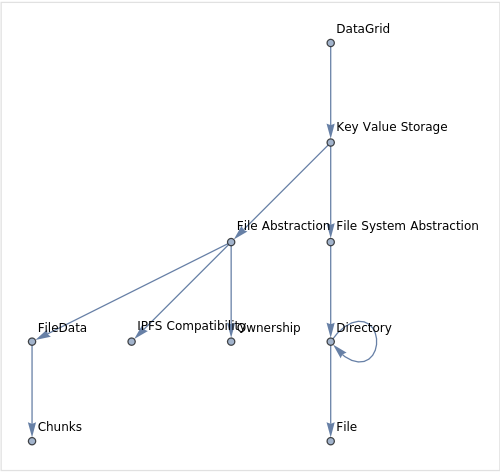

A datalake solution that enables the storage of permissioned arbitrary data blobs and infinite-data computing.

## 🤷‍♀️ How?

TLDR; It stores blobs by hash. And loads and retrieves them...

## 🌎 Ecosystem

With a datalake come the ecosystem, there are numerous of tools, utilities you can use to interface with the datalake. Listed below are a few of them.

- [DataGrid](.system/datagrid/README.md) - The core data storage and retrieval system.
- [action-webzip-upload] - Github Actions uploader
- [edgerouter.rs](https://github.com/v3xlabs/edgeserver) - A webserver that serves the datalake over HTTP.
- XX - smart and fast tagged bookmarks
- XX - photoboard
- XX - infinite canvas-style organizer

## 🧑‍🔬 Data Model

But here is what the AI thought

